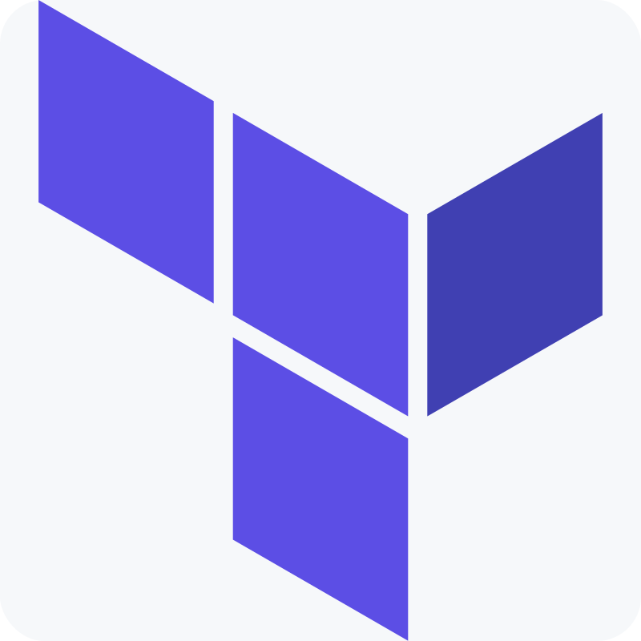
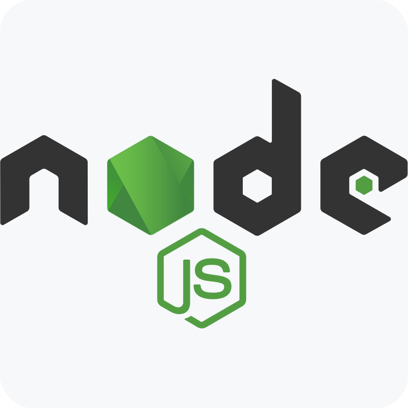

## Hi there 👋

I've wanted to build something massive for a while now. Something that would challenge me and help me grow as a developer. I've always been fascinated by distributed systems and how they work. I've also been a fan of video streaming services like Netflix and YouTube. So I decided to combine the two and build my own video streaming microservices application. It's nothing fancy but it's a start.

- 🔭 I’m currently building [FlixTube](https://github.com/JayKay24/flix-tube), a video-streaming microservices application. Inspired by [Boostrapping Microservices](https://github.com/bootstrapping-microservices-2nd-edition).
- 🌱 FlixTube leverages the following technologies:
  <table>
    <tr>
      <td align="center"> Terraform</td>
      <td align="center"> TypeScript</td>
      <td align="center"> Kubernetes</td>
    </tr>
    <tr>
      <td align="center"> Microsoft Azure</td>
      <td align="center"> Bash 5</td>
      <td align="center"> Linux VM</td>
    </tr>
    <tr>
      <td align="center"> Docker</td>
      <td align="center"> Nx</td>
      <td align="center"> Mongo DB</td>
    </tr>
    <tr>
      <td align="center"> RabbitMQ</td>
      <td align="center"> GitHub</td>
      <td align="center"> Next.js</td>
    </tr>
    <tr>
      <td align="center">  Git</td>
      <td align="center">  Playwright</td>
      <td align="center">  Jest</td>
    </tr>
    <tr>
      <td align="center">  NestJS</td>
      <td align="center">  HTTP</td>
      <td align="center">  Node.js</td>
    </tr>
  </table>  
- 👯 I’m looking to collaborate on interesting distributed systems applications.
- 💬 Ask me about:
  * Microservices
  * Distributed Systems
  * Cloud Computing
  * DevOps
  * Web Application Security
- 📫 How to reach me:
  <table>
    <tr>
      <td align="center">
        
      </td>
      <td>
        <a href="https://www.linkedin.com/in/james-kinyua-njuguna/">
          <strong>
            James Kinyua Njuguna
          </strong>
        </a>
      </td>
    </tr>
  </table>
- 😄 Pronouns: He/Him
- ⚡ Fun fact: I haven't watched a lot of popular animes, I promise I'll start. I've watched Cowboy Bebop though 😀! See you, space cowboy!
