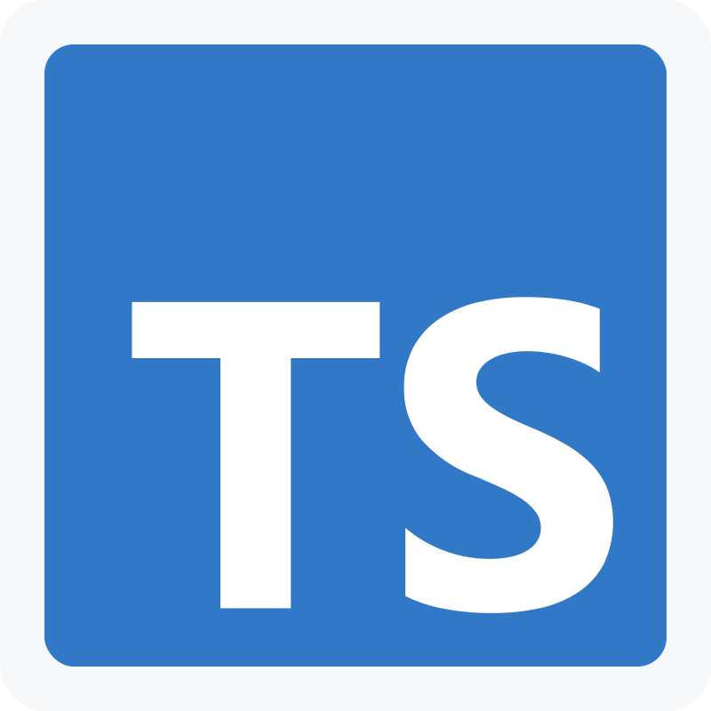
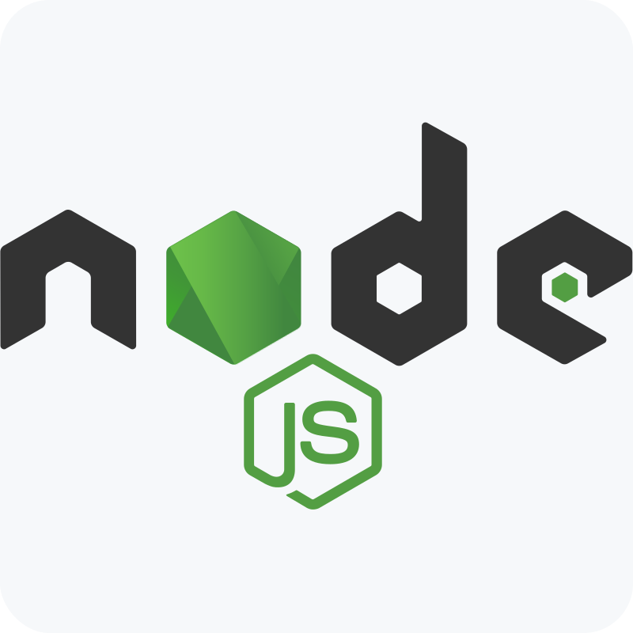
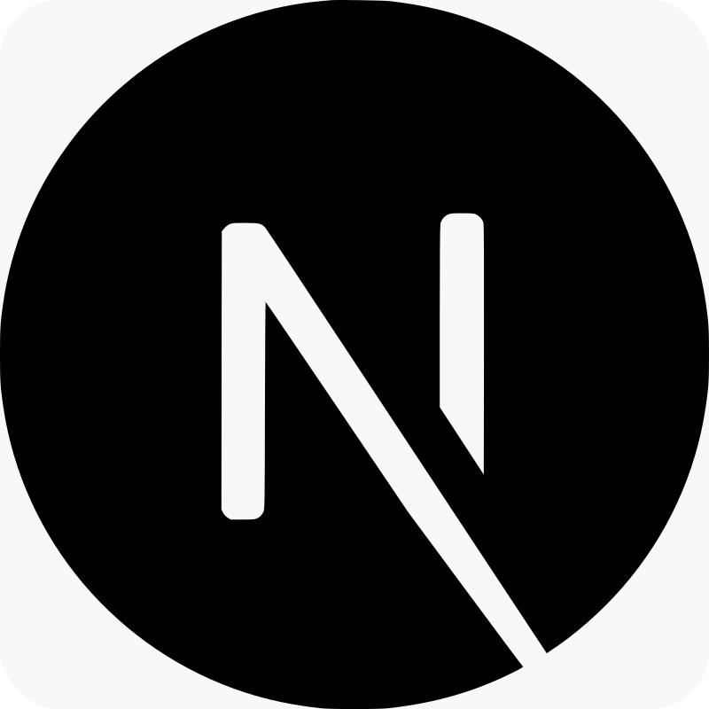
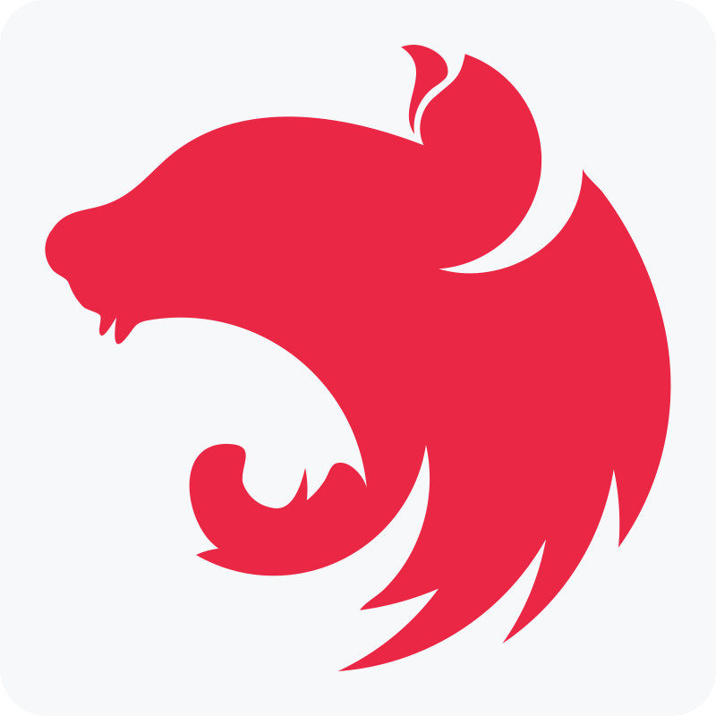
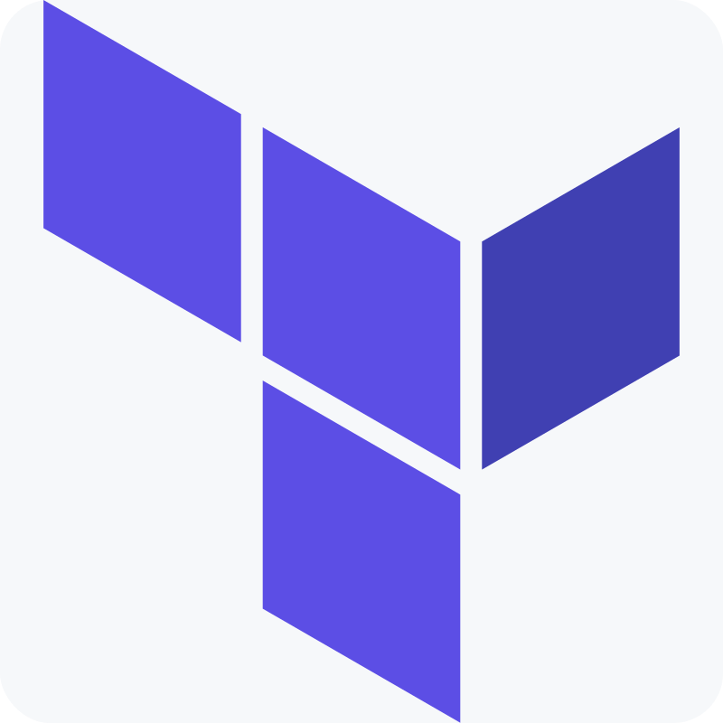
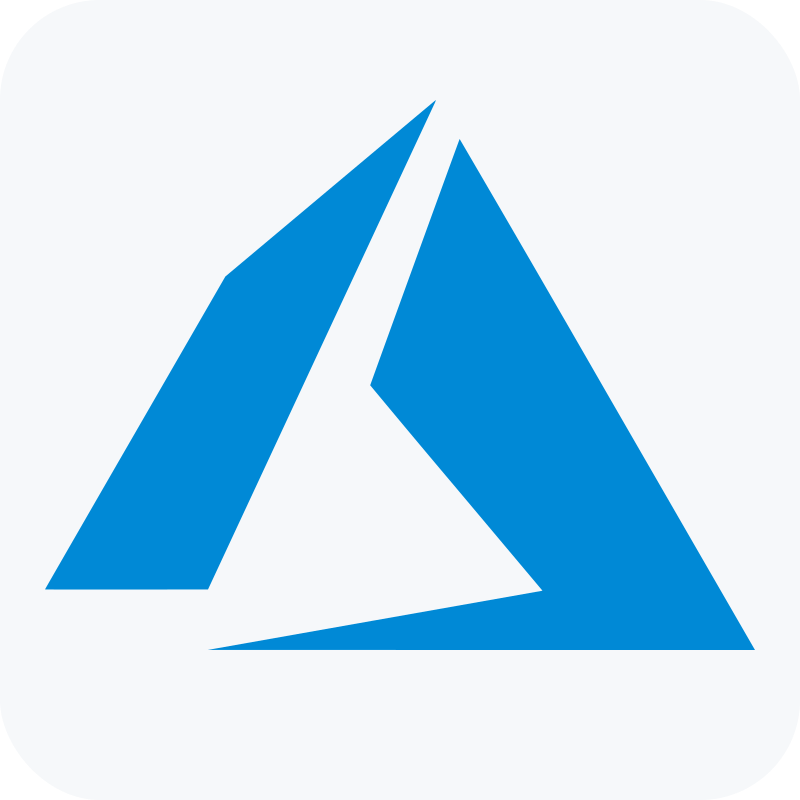
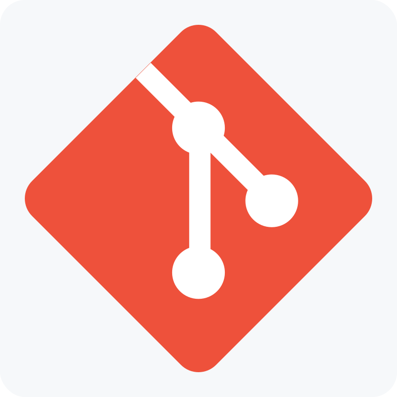

## Hi there 👋

I've wanted to build something massive for a while now, leveraging a myriad of technologies and frameworks. Something that would challenge me and help me grow as a software engineer. I've always been fascinated by distributed systems like Netflix and Youtube, and how they work. 

***So I decided to go for it and BUILD MY OWN video streaming microservices application!*** 😅

It's nothing fancy but it's a start.

- 🔭 I’m currently building [FlixTube](https://github.com/JayKay24/flix-tube), a video-streaming microservices application. Inspired by the [Boostrapping Microservices](https://bootstrapping-microservices.com) book by [Ashley Davis](https://github.com/ashleydavis).
- 📂 I'm also working on [ShiftSync](https://github.com/JayKay24/ShiftSync), but FlixTube remains my main focus.
- 🌱 While building FlixTube and ShiftSync, I've gained a lot of experience with the following technologies:

  **Languages & Runtimes**
  <table bgcolor="#f6f8fa">
    <tr>
      <td align="center"> <b>TypeScript</b></td>
      <td align="center"> <b>Node.js</b></td>
      <td align="center"> <b>Bash 5</b></td>
    </tr>
  </table>

  **Frameworks & Libraries**
  <table bgcolor="#f6f8fa">
    <tr>
      <td align="center"> <b>Next.js</b></td>
      <td align="center"> <b>NestJS</b></td>
      <td align="center"> <b>Drizzle ORM</b></td>
    </tr>
  </table>

  **Infrastructure & Cloud**
  <table bgcolor="#f6f8fa">
    <tr>
      <td align="center"> <b>Terraform</b></td>
      <td align="center"> <b>Kubernetes</b></td>
      <td align="center"> <b>Microsoft Azure</b></td>
      <td align="center"> <b>Docker</b></td>
      <td align="center"> <b>Linux VM</b></td>
    </tr>
  </table>

  **Databases & Messaging**
  <table bgcolor="#f6f8fa">
    <tr>
      <td align="center"> <b>PostgreSQL</b></td>
      <td align="center"> <b>Mongo DB</b></td>
      <td align="center"> <b>RabbitMQ</b></td>
    </tr>
  </table>

  **Tools & Testing**
  <table bgcolor="#f6f8fa">
    <tr>
      <td align="center"> <b>Git</b></td>
      <td align="center"> <b>GitHub</b></td>
      <td align="center"> <b>Nx</b></td>
      <td align="center"> <b>Playwright</b></td>
      <td align="center"> <b>Jest</b></td>
      <td align="center"> <b>HTTP</b></td>
    </tr>
  </table>  
- 👯 I’m looking to collaborate on interesting distributed systems applications.
- 💬 Ask me about:
  * Microservices
  * Distributed Systems
  * Cloud Computing
  * DevOps
  * Web Application Security
- 📫 How to reach me:
  <table>
    <tr>
      <td align="center">
        
      </td>
      <td>
        <a href="https://www.linkedin.com/in/james-kinyua-njuguna/">
          <strong>
            James Kinyua Njuguna
          </strong>
        </a>
      </td>
    </tr>
  </table>
  
- 😄 Pronouns: He/Him
- ⚡ Fun fact: I haven't dipped my toes into the anime world as much as I'd like to, but Here's a small list of some I find interesting:

  * [Vinland Saga](https://en.wikipedia.org/wiki/Vinland_Saga_(TV_series))
  * [Cowboy Bebop](https://en.wikipedia.org/wiki/Cowboy_Bebop)
